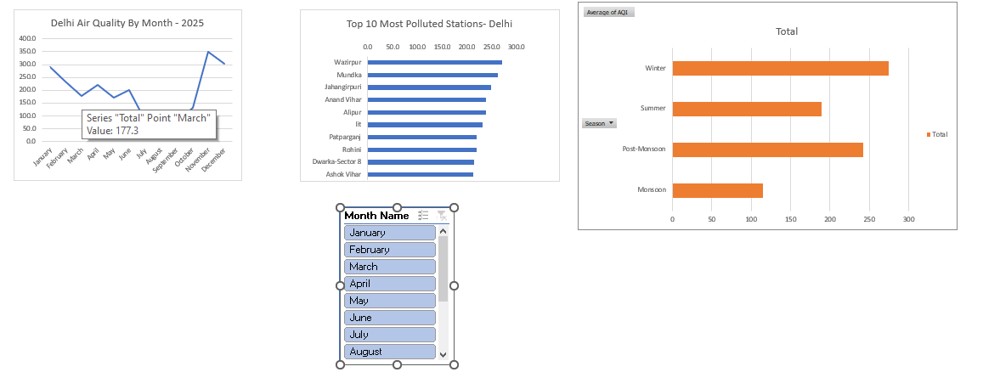

# Delhi Air Quality (AQI) Dashboard 2025 — Excel

Excel dashboard analyzing 134,516 hourly air quality readings across 10 
monitoring stations in Delhi (2025), covering pollutants, weather, and 
calculated AQI values.

## Key Finding
Winter air quality in Delhi is more than **2x worse than Monsoon season** — 
average AQI of 274 (Winter) vs 115 (Monsoon). Post-Monsoon (242) is nearly 
as bad as Winter, meaning roughly half the year sits in "Poor" or worse 
territory.

## Other Insights
- 10,456 station-hours recorded "Severe" AQI — the worst official category
- Pusa, Mundka, and Wazirpur are the most frequently Severe-rated stations
- AQI Category breakdown: Moderate (46,458 hrs), Poor (29,224), Satisfactory 
  (27,021), Very Poor (13,115), Severe (10,456), Good (8,242)
- Roughly even day/night reading distribution across the dataset

## Data Quality Note
A small number of readings show AQI values above the official 500 cap 
(max observed: 1000) — flagged here rather than silently smoothed over, 
likely due to uncapped raw calculation rather than a true reading.

## Dashboard Features
- Monthly, station-wise, and season-wise PivotTables and PivotCharts
- Interactive Month slicer
- Dataset: 134,516 hourly readings across 10 Delhi monitoring stations 
  (not included in repo due to file size — available on request)

## Tools
Microsoft Excel — PivotTables, PivotCharts, Slicers
